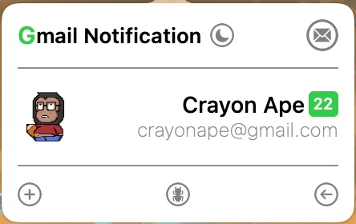

## Gmail Notification

A tiny Gmail client for Mac to retrieve notifications. 

#### Backstory

I think browser is already the best Gmail client, but I couldn't be notified of the new email if I don't open the browser. The desktop notification in Gmail's setting doesn't work for me, so I decided to write an app which could inform me when I have new email, that's it.

A week ago I knew nothing about [Swift]([Swift - Apple Developer](https://developer.apple.com/swift/))/ [SwiftUI]([SwiftUI Overview - Xcode - Apple Developer](https://developer.apple.com/xcode/swiftui/))/ [AppKit]([AppKit | Apple Developer Documentation](https://developer.apple.com/documentation/appkit/)), but now I succeeded in making out  this tiny app. Thougn I'm pretty sure there are a lot of bugs in it, but it works! that's enough for me.

## User Manual

##### App Status

The  **G** on the top-left corner displays the app status:

**G** : You are successfully signed in.

**G** : Gmail restores your session using the keychain, if it fails to restore, you need to check your network/ restart app/ click + to sign in again.

**G** : You are signed out / disconnected.

##### App Theme

The **Moon** beside the title is used to change app theme, currently light/ dark mode is available.

##### Open Gmail

The **Envelop** on the top-right corner is used to open Gmail in browser.

##### Avatar

Fetching avatar is asynchronously, if it fails, you can click the avatar circle to fetch it again.

##### Name && Email Address

As displayed.

##### Count of unread emails

The **Number** indicates how many emails are unread.

The **Green** indicates your connection to Gmail api is successful.

The **Red** indicates your connection to Gmail api is failed, usually you can ignore this because once your network recovers, it'll turn green again.

##### Plus Button

Click it to get authorization from Gmail, also you can get another account's authorization.

##### Bug Button

Click it to raise an issue/ donate/ etc.

##### Exit Button

Exit the app.

## Others

This app is based on Google's [GIDSignIn](https://developers.google.com/identity/sign-in/), it only supports one account. If you need to support multiple accounts, [GTMAppAuth](https://github.com/google/GTMAppAuth) is a choice. Cause I don't have much time now, maybe I'll support this later.

## Donate

If you find this app helpful, you can buy me a coffee.

    **AliPay**

    **Wechat**

   **Paypal**

